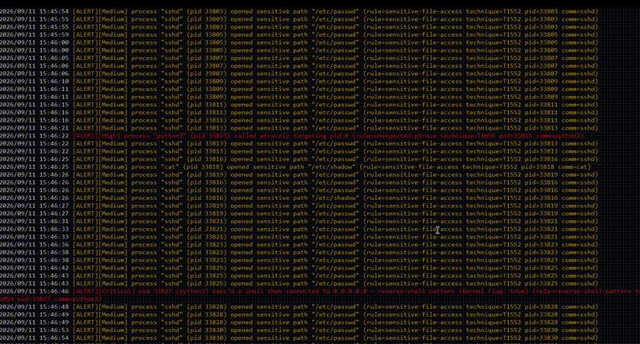
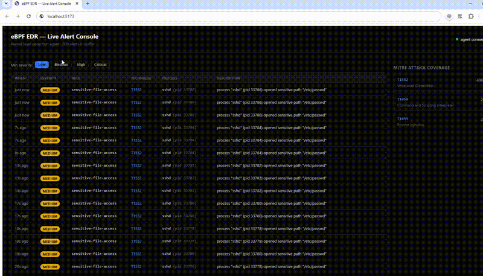

# Sentinel-eBPF: Kernel-Level Threat Detection for Linux

> **Status:** Research / Security Engineering Project
> **Architecture:** eBPF (C) + Go Userspace Agent + React/TypeScript Dashboard
> **Platform:** Linux
> **Author:** [locallhosts](https://github.com/locallhosts)



Sentinel-eBPF is a Linux security monitoring and detection project built around **eBPF**.

The goal is to collect security-relevant telemetry at the kernel level rather than relying exclusively on traditional userland API hooks. The project combines eBPF-based telemetry, a Go detection engine, and a React/TypeScript SOC-style dashboard to turn low-level Linux events into actionable security alerts.

> **Note:** Sentinel-eBPF is a research and security engineering project, not a claim of complete or production-grade EDR coverage. Detection rules are intentionally focused on a limited set of behaviors and should be evaluated in the context of the target environment.

---

## Why eBPF?

Many userland monitoring approaches depend on hooking APIs provided by libraries such as `libc`. Applications can sometimes avoid those hooks by making system calls directly or by using alternative execution paths.

Sentinel-eBPF moves a portion of the telemetry collection closer to the kernel, allowing the agent to observe selected system and networking activity independently of the normal userland API path.

The project currently focuses on:

* Process execution
* Sensitive file access
* Memory protection changes
* Cross-process memory operations
* `ptrace()` activity
* Environment-variable based injection indicators
* Outbound TCP connections
* Process ancestry
* Stateful behavioral correlations

The objective is not to claim that eBPF makes telemetry impossible to evade. Instead, it provides a different observation point that reduces reliance on userland hooks and makes certain classes of bypass more difficult.

---

# Architecture

```text
                         Linux Kernel
                              │
                    ┌─────────┴─────────┐
                    │     eBPF / C      │
                    │                   │
                    │ Tracepoints       │
                    │ Kprobes           │
                    │ BPF Maps          │
                    └─────────┬─────────┘
                              │
                         BPF Ring Buffer
                              │
                              ▼
                     ┌─────────────────┐
                     │    Go Agent     │
                     │                 │
                     │ Event decoding  │
                     │ Enrichment      │
                     │ Correlation     │
                     │ Detection       │
                     │ Metrics         │
                     │ REST API        │
                     └────────┬────────┘
                              │
                   ┌──────────┴──────────┐
                   │                     │
                   ▼                     ▼
              Prometheus           React / TS
                                      SOC UI
```

The system is divided into three main components.

---

## 1. Kernel Telemetry — eBPF / C

The kernel-side programs live in:

```text
bpf/monitor.bpf.c
```

The project uses **BPF Type Format (BTF)** and CO-RE techniques to reduce dependency on a single kernel build.

### Tracepoints

Sentinel-eBPF currently observes selected system calls through tracepoints, including:

* `execve`
* `openat`
* `ptrace`
* `mprotect`
* `process_vm_writev`

Tracepoints provide a relatively stable instrumentation interface compared with depending on specific kernel function implementations.

### Kprobes

The project also uses a kprobe on:

```text
tcp_v4_connect
```

This provides visibility into selected outbound IPv4 TCP connection attempts at the kernel level.

### BPF Maps

BPF maps are used to maintain limited state needed for behavioral correlation.

For example, process execution information can be associated with a PID and later used when another event is observed from that process.

This allows the project to identify patterns that cannot be detected reliably from isolated events.

### Verifier Constraints

One of the more challenging parts of developing the eBPF programs was working within the constraints imposed by the eBPF verifier.

The kernel-side code uses bounded and verifier-safe operations when processing data such as process arguments and environment variables.

For example, the project checks for indicators such as:

```text
LD_PRELOAD
```

during process execution.

---

# 2. Userspace Agent — Go

The userspace agent lives under:

```text
agent/
```

The Go agent is responsible for consuming kernel events and turning them into higher-level security events.

### Ring Buffer

Events are transferred from the eBPF programs through a:

```text
BPF_MAP_TYPE_RINGBUF
```

The Go agent consumes these records and decodes the shared event structure defined by the project.

This provides an efficient kernel-to-userspace event path while avoiding the need for every event to be handled through a traditional syscall interface.

### Detection Engine

The main detection and correlation logic is implemented in:

```text
agent/detect.go
```

The detection engine can combine individual events into higher-level behaviors.

Examples include:

```text
Web server
    ↓
Shell execution
    ↓
Outbound connection
    ↓
Potential reverse-shell behavior
```

and:

```text
Process A
    ↓
Cross-process memory operation
    ↓
Potential process injection
```

### Metrics

The agent exposes Prometheus-compatible metrics through:

```text
/metrics
```

These metrics can be used to monitor things such as event processing and ring-buffer behavior.

### REST API

Structured alerts are exposed through:

```text
/api/alerts
```

This provides the frontend with a simple interface for displaying detected activity.

---

# 3. SOC Dashboard — React / TypeScript

The dashboard lives under:

```text
dashboard/
```

It provides a lightweight SOC-style interface for viewing alerts generated by the Go agent.

Current functionality includes:

* Real-time alert polling
* Severity filtering
* Alert details
* MITRE ATT&CK technique mapping
* Event timestamps
* Process information
* Security event classification

The dashboard is intentionally simple so that the focus remains on the underlying detection pipeline.

---

# Detection Coverage

The current detection set focuses on several Linux behaviors that can be useful as security signals.

| Detection                    | ATT&CK Mapping | Severity | Description                                                                          |
| ---------------------------- | -------------- | -------: | ------------------------------------------------------------------------------------ |
| `wx-memory-bypass`           | T1055*         | Critical | Observes `mprotect()` requests that include both `PROT_WRITE` and `PROT_EXEC`.       |
| `cross-process-memory-write` | T1055.009      | Critical | Observes `process_vm_writev()` activity involving another process.                   |
| `reverse-shell-pattern`      | T1059*         | Critical | Correlates shell/interpreter execution with subsequent outbound TCP activity.        |
| `ld-preload-injection`       | T1574.006      |     High | Detects processes launched with an `LD_PRELOAD` environment variable.                |
| `shell-from-webserver`       | T1059.004*     |     High | Correlates shell execution with selected web-server parent processes.                |
| `unexpected-ptrace`          | T1055*         |     High | Flags selected `ptrace()` activity outside configured debugger/profiler patterns.    |
| `argv0-filename-mismatch`    | T1036.005*     |   Medium | Looks for discrepancies between the executed binary and the supplied `argv[0]`.      |
| `sensitive-file-access`      | T1552*         |   Medium | Monitors access to selected sensitive files such as `/etc/passwd` and `/etc/shadow`. |

* **ATT&CK mappings are approximate behavioral mappings, not claims that every event necessarily represents the associated technique.**

### Important detection considerations

These detections are intentionally behavior-based and can generate false positives.

For example:

```text
PROT_WRITE | PROT_EXEC
```

is not inherently malicious.

JIT engines such as V8 may legitimately request executable writable memory during runtime compilation.

Therefore, a production implementation would need additional context such as:

* Process identity
* Executable path
* Parent process
* Container context
* Command line
* Historical behavior
* Allow-lists
* File reputation
* User/session context

The current project intentionally exposes the low-level event rather than attempting to solve every false-positive scenario.

---

# Live Evidence & Verification

The project has been tested on a live Ubuntu 22.04 environment.

The following screenshots and recordings show the telemetry pipeline operating from kernel events through the Go agent and into the React dashboard.

## 1. Agent Startup and Kernel Telemetry


The agent attaches to the configured tracepoints and kprobe and begins receiving security-relevant events.


The test environment generated events involving process execution, file access, and other monitored activity.

---

## 2. W^X / Memory Protection Detection


The project detected `mprotect()` calls requesting:

```text
PROT_WRITE | PROT_EXEC
```

during testing with Node.js/NPM.

This is an important example of why behavioral detections need context.

Node.js uses the V8 JavaScript engine, which relies on JIT compilation and can legitimately require executable memory.

The event therefore demonstrates that the kernel telemetry is working, but it should **not automatically be treated as proof of exploitation**.

In a production detection pipeline, legitimate JIT-heavy applications would typically require additional context or allow-listing.

---

## 3. JSON Alert API

The Go agent exposes structured security events through:

```text
/api/alerts
```


This creates a simple integration point for a SOC frontend, SIEM, SOAR system, or other security tooling.

---

## 4. React SOC Dashboard

The dashboard consumes alerts from the Go API and presents them in a real-time security-console format.




The dashboard can filter alerts by severity and display the associated detection and MITRE ATT&CK mapping.


---

# Testing Philosophy

The project is designed around a simple pipeline:

```text
Generate Behavior
       ↓
Kernel Event
       ↓
eBPF Program
       ↓
Ring Buffer
       ↓
Go Agent
       ↓
Detection / Correlation
       ↓
Alert
       ↓
SOC Dashboard
```

This makes it possible to test individual stages independently.

For example, a detection test can verify:

1. A process performs a monitored operation.
2. The eBPF program observes it.
3. An event is written to the ring buffer.
4. The Go agent receives the event.
5. The detection engine classifies it.
6. The API exposes the resulting alert.
7. The dashboard displays it.

---

# Limitations & Threat Model

Sentinel-eBPF is **not intended to claim complete malware visibility or kernel-level invulnerability**.

The current implementation has several important limitations.

### Kernel compromise

If an attacker has already compromised the kernel or has sufficiently powerful kernel-level privileges, eBPF-based monitoring cannot be treated as a trusted observation layer.

### Event coverage

The project monitors a selected set of events rather than every possible Linux security-relevant operation.

An attacker may therefore operate through behaviors that are outside the current telemetry coverage.

### False positives

Some monitored behaviors have legitimate uses.

Examples include:

* JIT compilation
* Debugging
* Profiling
* Administrative tools
* System utilities
* Security software

Detection rules therefore need environmental tuning.

### Ring-buffer loss

High event rates can create pressure on the ring buffer.

The agent exposes metrics that can be used to identify event loss or processing problems.

For a production deployment, monitoring and alerting on dropped events would be important.

### Kernel compatibility

CO-RE improves portability, but compatibility still depends on kernel capabilities, BTF availability, helper support, and the specific probes used by the project.

The project should therefore be tested against the kernel versions and distributions where it will actually be deployed.

---

# Performance & Observability

Performance should be measured rather than assumed.

Sentinel-eBPF exposes telemetry that can be used to evaluate:

* Event processing latency
* Ring-buffer behavior
* Event throughput
* Alert processing
* Userspace resource consumption

Future benchmarking will focus on measuring the overhead introduced by the monitoring pipeline under different event rates.

Example benchmark format:

```text
Kernel version:     5.x
CPU:                ...
Memory:             ...
Event rate:         ... events/sec
Dropped events:     ...
Agent CPU usage:    ...
Agent memory:       ...
Alert latency:      ...
```

> Performance numbers should be added here only after being measured under a reproducible workload.

---

# Deployment

## Prerequisites

Recommended test environment:

* Linux
* Ubuntu 22.04 LTS
* Kernel with BTF support
* Kernel version compatible with the project's eBPF features
* `clang` / `llvm`
* `libbpf`
* Go 1.21+
* Node.js 18+
* Appropriate privileges for loading and attaching eBPF programs

Check the running kernel:

```bash
uname -r
```

Check for BTF:

```bash
ls -l /sys/kernel/btf/vmlinux
```

Depending on the kernel configuration and deployment method, running the agent may require root privileges or appropriate Linux capabilities.

---

# Build & Run

## 1. Install dependencies

```bash
sudo apt update

sudo apt install -y \
    build-essential \
    clang \
    llvm \
    libbpf-dev \
    libelf-dev \
    linux-tools-common \
    linux-tools-generic \
    golang-go
```

## 2. Clone the repository

```bash
git clone https://github.com/locallhosts/ebpf-edr.git
cd ebpf-edr
```

## 3. Generate kernel type definitions

```bash
make vmlinux
```

This generates the kernel BTF-derived definitions required by the eBPF build.

## 4. Build the agent

```bash
make agent
```

## 5. Start the agent

```bash
sudo ./bin/edr-agent -addr :9090
```

---

# Dashboard

## Local Development

```bash
cd dashboard

npm install

VITE_AGENT_URL=http://localhost:9090 \
npm run dev -- --host
```

The development server will expose the React dashboard according to the Vite configuration.

---

# Docker Dashboard

The dashboard can be built as a static frontend:

```bash
docker build \
    -f deploy/Dockerfile.dashboard \
    -t locallhosts/edr-dashboard .
```

Run it with:

```bash
docker run \
    -p 8080:80 \
    locallhosts/edr-dashboard
```

The Go agent is intentionally deployed separately because the eBPF programs require access to the host kernel.

---

# Systemd Deployment

A systemd service definition is provided under:

```text
deploy/edr-agent.service
```

Install it with:

```bash
sudo cp deploy/edr-agent.service \
    /etc/systemd/system/edr-agent.service

sudo systemctl daemon-reload

sudo systemctl enable --now edr-agent
```

Check the service:

```bash
sudo systemctl status edr-agent
```

View logs:

```bash
sudo journalctl -u edr-agent -f
```

Before production use, review the systemd unit and adjust its privileges, paths, capabilities, and filesystem restrictions for the target environment.

---

# Repository Structure

```text
ebpf-edr/
├── bpf/
│   ├── vmlinux.h
│   ├── events.h
│   └── monitor.bpf.c
│
├── agent/
│   ├── main.go
│   ├── loader.go
│   ├── events.go
│   ├── detect.go
│   ├── store.go
│   ├── metrics.go
│   ├── api.go
│   ├── util.go
│   └── monitor.bpf.o
│
├── dashboard/
│   ├── src/
│   │   ├── App.tsx
│   │   ├── useAlerts.ts
│   │   └── types.ts
│   └── package.json
│
├── deploy/
│   ├── edr-agent.service
│   └── Dockerfile.dashboard
│
├── docs/
│   └── assets/
│
├── Makefile
├── LICENSE
└── README.md
```

---

# Roadmap

Potential future improvements include:

* [ ] Expand syscall and kernel telemetry coverage
* [ ] Add additional process ancestry correlations
* [ ] Add configurable allow-lists
* [ ] Improve JIT/W^X contextual detection
* [ ] Add container-aware detection
* [ ] Add automated integration tests
* [ ] Add GitHub Actions CI
* [ ] Add reproducible performance benchmarks
* [ ] Add event-loss stress testing
* [ ] Add more network telemetry
* [ ] Add configurable detection policies
* [ ] Improve alert deduplication
* [ ] Add richer SIEM/SOAR integration

---

# Security Considerations

Sentinel-eBPF loads programs into the Linux kernel through the eBPF subsystem.

Only deploy the project on systems where the source code, compiled artifacts, and deployment configuration have been reviewed and trusted.

The project should be treated as security-sensitive software and tested in an isolated environment before deployment on production systems.

---

# License

MIT License. See [`LICENSE`](LICENSE) for details.
