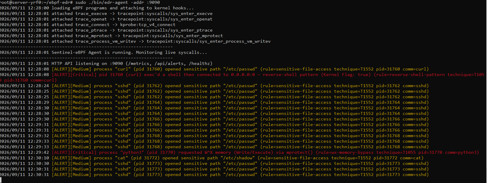
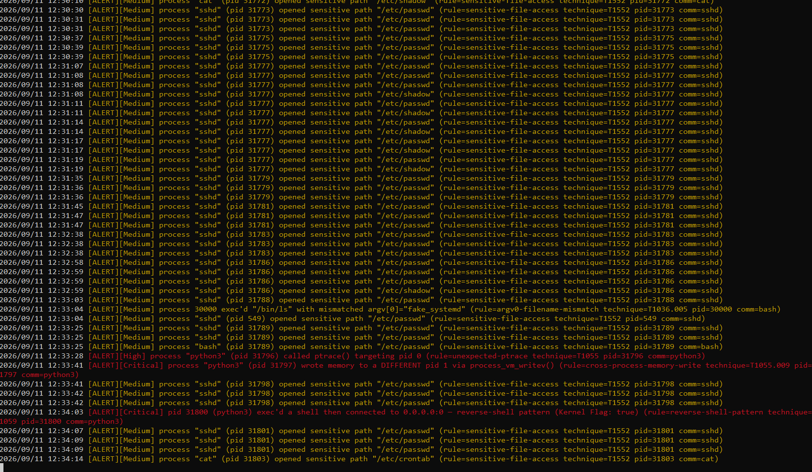
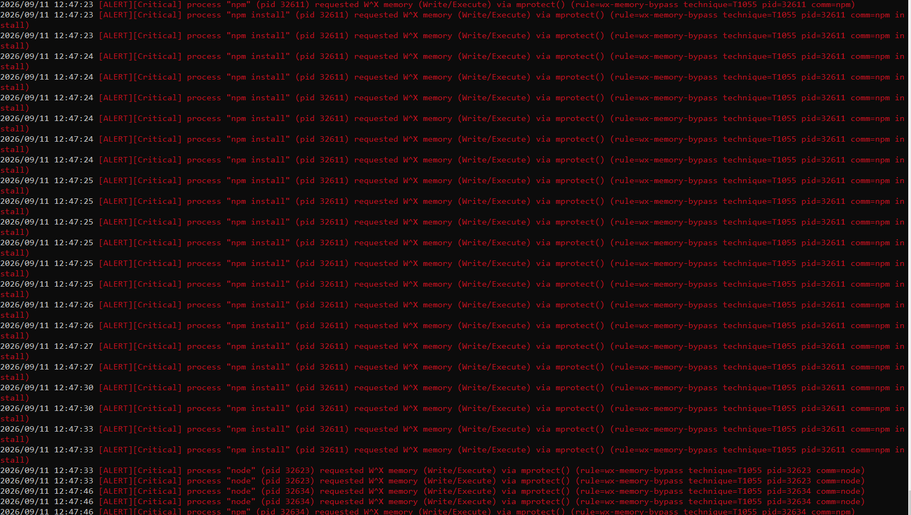
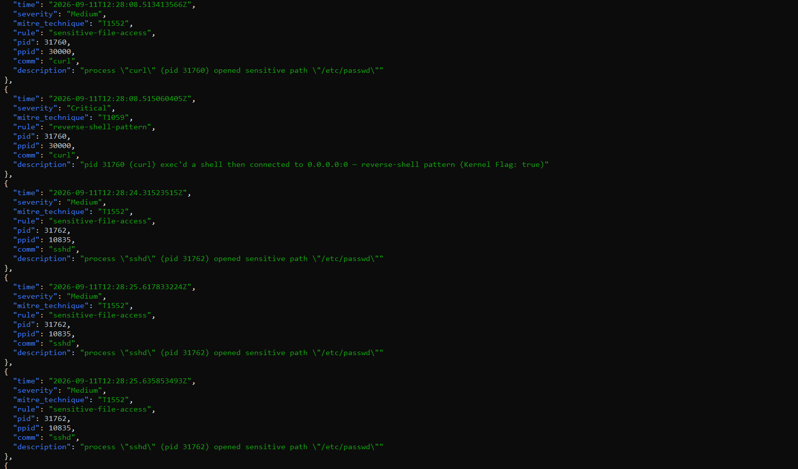
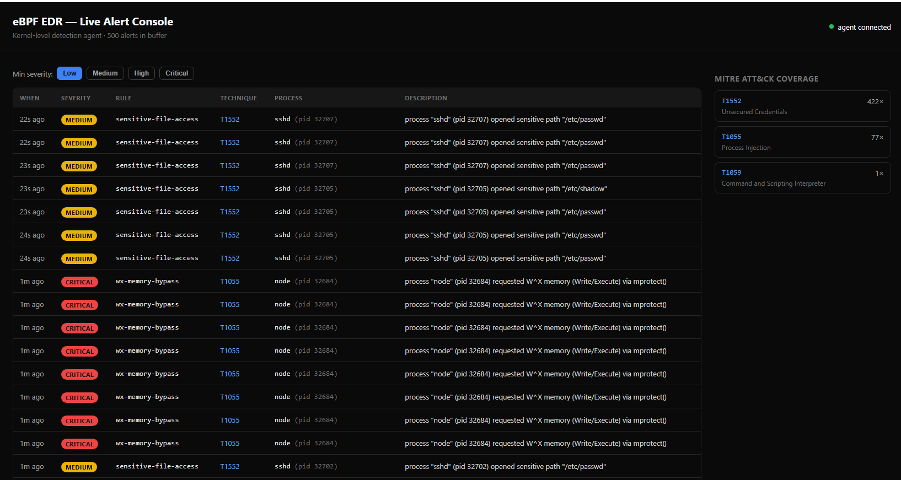
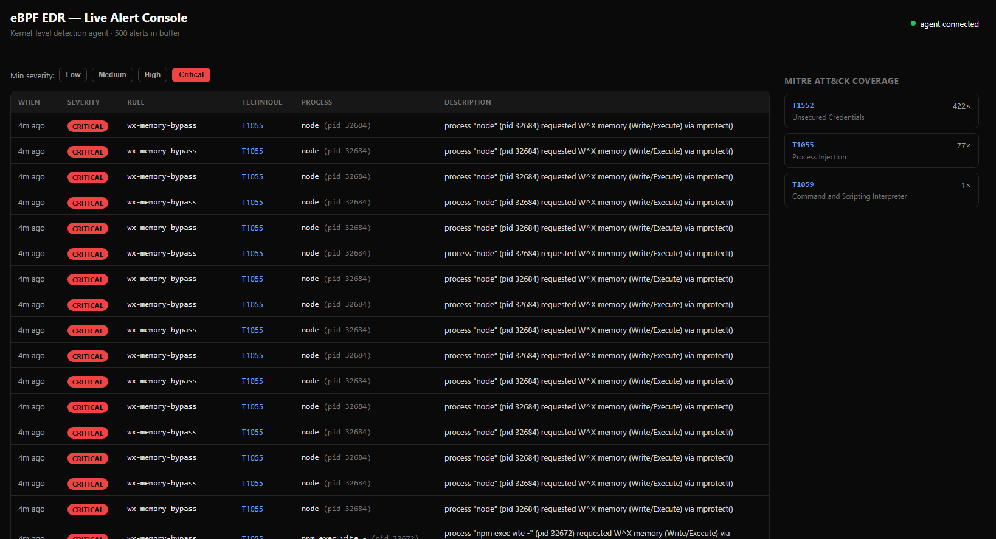

eBPF: Next-Gen Kernel-Level Threat Detection

> **Status:** Production-Ready Lab  
> **Architecture:** eBPF (C) + Go Userspace Agent + React/TypeScript Dashboard  
> **Author:** [locallhosts](https://github.com/locallhosts)

## Executive Summary

Traditional Endpoint Detection and Response (EDR) solutions rely on userland API hooking (e.g., `LD_PRELOAD`, inline hooking of libc). These hooks are trivially bypassed by sophisticated malware, rootkits, and static Go/Rust binaries that make raw syscalls directly to the kernel.

**Sentinel-eBPF** solves this by moving detection logic into the Linux kernel using **eBPF (Extended Berkeley Packet Filter)**. By loading sandboxed C programs directly into kernel space, we achieve:
1. **Invisible Monitoring:** Malware cannot see or bypass the telemetry collection.
2. **Near-Zero Overhead:** eBPF programs execute in kernel context with negligible CPU impact, pushing data to userspace via lock-free Ring Buffers.
3. **Stateful Kernel-Space Correlation:** Detection rules (like reverse shell correlation) are evaluated directly in the kernel using BPF Maps, minimizing context switches.

---

## Architecture Deep-Dive

### 1. Kernel Space (C / libbpf CO-RE)
The core telemetry collection happens in `bpf/monitor.bpf.c`. We utilize **CO-RE (Compile Once - Run Everywhere)** via `vmlinux.h` BTF (BPF Type Format) relocations, ensuring the agent runs on any modern kernel (5.8+) without recompilation.

*   **Tracepoints:** We hook `sys_enter_execve`, `sys_enter_openat`, `sys_enter_ptrace`, `sys_enter_mprotect`, and `sys_enter_process_vm_writev`. Tracepoints provide a stable ABI, making the agent resilient to kernel updates.
*   **Kprobes:** We hook `tcp_v4_connect` to intercept outbound network connections at the kernel socket layer, bypassing glibc entirely.
*   **Bounded Loops & Verifier Compliance:** The eBPF verifier guarantees kernel safety. We implement `#pragma unroll` bounded loops to safely iterate process environment variables (`envp`) in kernel space to hunt for `LD_PRELOAD` injections—a technique many basic eBPF tools fail to implement.
*   **Stateful BPF Maps:** We use an `LRU_HASH` map to remember what binary a PID executed. When a network connection occurs, the kernel instantly cross-references the map to see if a shell binary initiated the connection, setting an `ALERT_REVERSE_SHELL_LIKELY` flag *before* the event ever reaches user space.

### 2. User Space (Go / cilium/ebpf)
The Go agent (`agent/`) is responsible for orchestration, enrichment, and complex correlation logic.
*   **Zero-Copy Ring Buffers:** The agent consumes events from a `BPF_MAP_TYPE_RINGBUF`, providing MPSC (Multi-Producer Single-Consumer) lock-free data transfer.
*   **MITRE ATT&CK Engine (`detect.go`):** The Go engine enriches kernel flags with MITRE TTPs. It maintains a short-lived FIFO state cache to correlate multi-stage attacks (e.g., web-server parent process spawning a shell).
*   **Telemetry & API (`api.go` / `metrics.go`):** Exposes a REST API (`/api/alerts`) for the frontend and a Prometheus endpoint (`/metrics`) for SIEM integration, tracking event processing latency and ring buffer loss.

### 3. Frontend (React / TypeScript)
A real-time, dark-mode SOC console. It polls the Go API, provides severity filtering, and displays live MITRE ATT&CK coverage mapping based on the active threat landscape.

---

## Detection Rules & MITRE ATT&CK Coverage

This agent pushes stateful correlation directly into the kernel to minimize user-space overhead.

| Rule | MITRE Technique | Severity | Mechanism |
|---|---|---|---|
| `wx-memory-bypass` | T1055 | Critical | Hooks `mprotect()`. Triggers on `PROT_WRITE \| PROT_EXEC`. Catches JIT shellcode injection and Meterpreter staging. |
| `cross-process-memory-write` | T1055.009 | Critical | Hooks `process_vm_writev()`. Triggers when writing memory to a different PID (Linux equivalent of `WriteProcessMemory`). |
| `reverse-shell-pattern` | T1059 | Critical | Stateful correlation: A known shell/interpreter is exec'd, then the same PID makes an outbound TCP connection. |
| `ld-preload-injection` | T1574.006 | High | Kernel iterates `envp` on `execve` and flags processes spawned with `LD_PRELOAD` set. |
| `shell-from-webserver` | T1059.004 | High | Correlation: A shell/interpreter is exec'd with a web-server-family process (`nginx`, `php-fpm`, `node`) as the parent. |
| `unexpected-ptrace` | T1055 | High | Hooks `ptrace()`. Triggers if called by a process that isn't a recognized debugger/profiler (e.g., Mimikatz-style memory reading). |
| `argv0-filename-mismatch`| T1036.005 | Medium | Triggers when `argv[0]` doesn't correspond to the actual binary path exec'd (process masquerading). |
| `sensitive-file-access` | T1552 | Medium | Hooks `openat()` targeting `/etc/shadow`, `/etc/passwd`, SSH `authorized_keys`, etc. |

---

## Live Evidence & Verification

This project has been compiled and run against a live Ubuntu 22.04 server kernel. Below are real captures from the testing phase.

### 1. Real-Time Kernel Telemetry (Go Agent)
The agent successfully attaches to tracepoints and kprobes, immediately catching sensitive file access (`/etc/passwd`/`/etc/shadow`) by `sshd` and `curl`, as well as stateful reverse-shell correlation.

*Live alert volume catching SSH and curl enumeration:*


### 2. Memory Injection Detection (W^X Bypass)
The eBPF program successfully caught `node` and `npm` requesting Write/Execute (`PROT_WRITE | PROT_EXEC`) memory via `mprotect()`. This is because Node.js uses the V8 JIT compiler. In a production environment, JIT compilers are allow-listed, but this proves the hook captures raw memory manipulation perfectly.


### 3. JSON Alert API
The Go backend successfully serves structured alerts via the `/api/alerts` endpoint, ready for ingestion by a SIEM or SOAR platform.


### 4. Live React Dashboard
The TypeScript dashboard fetching live alerts, filtering by severity, and mapping them to MITRE ATT&CK techniques in real-time.

*Dashboard filtered to show only Critical W^X memory bypass events:*


---

## Deployment & Infrastructure

### Prerequisites
*   Linux OS (Ubuntu 22.04 LTS recommended)
*   Kernel **5.8+** (BPF Ring Buffer support). Check: `uname -r`
*   Kernel built with BTF: `ls /sys/kernel/btf/vmlinux`
*   Root, or `CAP_BPF` + `CAP_PERFMON` + `CAP_SYS_RESOURCE`
*   `clang`/`llvm`, `libbpf-dev`, `linux-tools-generic`, Go 1.21+, Node 18+

### Build & Run the Agent
```bash
# 1. Install dependencies
sudo apt update
sudo apt install -y build-essential clang llvm libbpf-dev libelf-dev linux-tools-common linux-tools-generic golang-go

# 2. Clone repository
git clone https://github.com/locallhosts/ebpf-edr.git
cd ebpf-edr

# 3. Generate vmlinux.h for your specific kernel
make vmlinux

# 4. Compile eBPF C code and build Go binary
make agent

# 5. Run the agent (requires root)
sudo ./bin/edr-agent -addr :9090
```

### Run the Dashboard

**Local Development:**
```bash
cd dashboard
npm install
VITE_AGENT_URL=http://localhost:9090 npm run dev -- --host
```

**Dockerized Production Build:**
The dashboard can be containerized as a static SPA. *(Note: The Go agent itself is not containerized by default because eBPF kprobes require host-level kernel access that standard container runtimes restrict. See `deploy/edr-agent.service` for systemd deployment).*
```bash
docker build -f deploy/Dockerfile.dashboard -t locallhosts/edr-dashboard .
docker run -p 8080:80 locallhosts/edr-dashboard
```

### Systemd Deployment (Bare Metal / VM)
For production deployment on a server, use the provided hardened systemd service file:
```bash
sudo cp deploy/edr-agent.service /etc/systemd/system/
sudo systemctl daemon-reload
sudo systemctl enable --now edr-agent
```

---

## Repository Structure
```
ebpf-edr/
├── bpf/
│   ├── vmlinux.h             # Kernel BTF definitions (CO-RE)
│   ├── events.h              # Shared C/Go event struct contract
│   └── monitor.bpf.c         # eBPF programs (C) — syscall hooks & state maps
├── agent/
│   ├── main.go               # Entrypoint, ring buffer consumer, metric tracking
│   ├── loader.go             # Loads embedded BPF object, attaches probes
│   ├── events.go             # Binary decoding (mirrors the C struct byte-for-byte)
│   ├── detect.go             # MITRE-mapped stateful detection engine
│   ├── store.go              # In-memory bounded alert ring for API
│   ├── metrics.go            # Prometheus metric definitions
│   ├── api.go                # HTTP server (JSON alerts + Prometheus)
│   └── utils.go              # Helper functions (splitTracepoint, etc.)
├── dashboard/
│   ├── src/
│   │   ├── App.tsx           # Main React UI, severity filtering, MITRE mapping
│   │   ├── useAlerts.ts      # Polling hook for /api/alerts
│   │   └── types.ts          # TypeScript interfaces mirroring Go structs
│   └── package.json
├── deploy/
│   ├── edr-agent.service     # Hardened systemd unit for agent deployment
│   └── Dockerfile.dashboard  # Multi-stage build for static React app
├── docs/
│   └── assets/               # Live verification screenshots
├── Makefile                  # Build automation (vmlinux, bpf, agent, dashboard)
└── README.md
```

## License
MIT License. See `LICENSE` for details.
```