# eBPF EDR — Linux Kernel Security Telemetry & Detection


[](https://github.com/locallhosts/ebpf-edr/actions/workflows/build.yml)
[](https://ebpf.io/)
[](https://go.dev/)
[](https://react.dev/)
[](https://www.linux.org/)
[](LICENSE)

eBPF EDR is a Linux endpoint-security research project that combines **kernel-level eBPF instrumentation**, a **Go userspace telemetry and detection agent**, and a **React/TypeScript security dashboard**.

The system is designed to demonstrate how security telemetry can be collected close to the Linux kernel, normalized in userspace, correlated into behavioral signals, and exposed through APIs for security operations tooling.


> **Status:** Research / Security Engineering Project  
> **Architecture:** eBPF/C + Go userspace agent + React/TypeScript dashboard  
> **Platform:** Linux  
> **Repository:** `locallhosts/ebpf-edr`

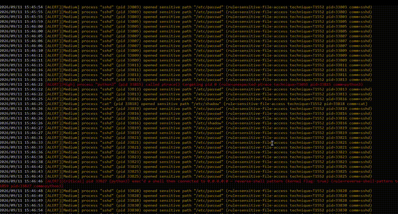

<p align="center">
  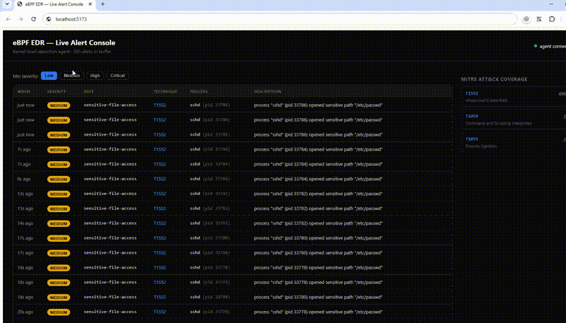
  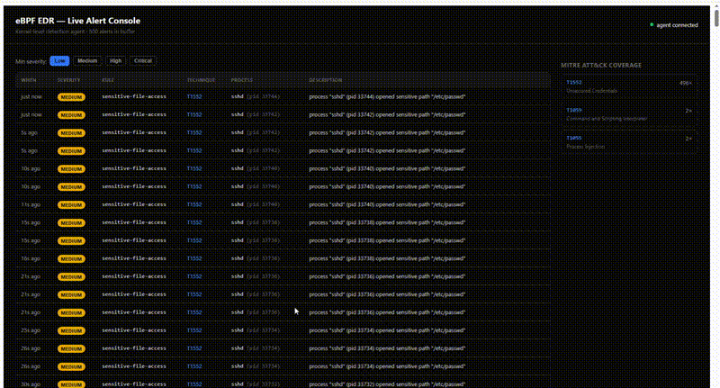
</p>


> **Visual evidence:** The screenshots and GIFs above are captured from the project's kernel telemetry, detection, API, and dashboard workflows.


eBPF EDR is a Linux security monitoring and detection-engineering project built around **eBPF**. It collects selected security-relevant activity close to the Linux kernel, transfers structured events through a BPF ring buffer, normalizes and correlates them in Go, and exposes security alerts and network telemetry through REST APIs and a React/TypeScript SOC-style dashboard.

The current implementation covers process and file activity, memory and cross-process operations, privilege and kernel-related signals, socket creation, TCP/UDP telemetry, and generic IPv4/IPv6 packet metadata.

> **Important:** This is a research/security-engineering implementation, not a claim of complete or production-certified EDR coverage. Detections are behavioral signals and must be interpreted in context.

---

## Contents

- [Why eBPF?](#why-ebpf)
- [Architecture](#architecture)
- [Architecture Diagram](#architecture-diagram)
- [Kernel Telemetry](#kernel-telemetry)
- [Network Telemetry](#network-telemetry)
- [Event ABI](#event-abi)
- [Userspace Agent](#userspace-agent)
- [Detection Engineering](#detection-engineering)
- [Detection Coverage](#detection-coverage)
- [SOC Dashboard](#soc-dashboard)
- [Live Evidence](#live-evidence)
- [Build & Run](#build--run)
- [Continuous Integration](#continuous-integration)
- [Security Model & Limitations](#security-model--limitations)
- [Repository Structure](#repository-structure)
- [Roadmap](#roadmap)

---

# Why eBPF?

Userspace monitoring can depend on library- or application-level observation. Applications may bypass some of those observation points by making syscalls directly or using alternate execution paths.

eBPF EDR moves selected telemetry collection closer to the Linux kernel. This provides a different observation point and reduces exclusive reliance on userspace API hooks.

The current implementation focuses on:

- Process execution
- Sensitive file access and persistence-sensitive writes
- `ptrace()`
- `mprotect()` and writable + executable memory
- Cross-process memory writes
- `LD_PRELOAD` indicators
- Fileless execution indicators
- Privilege transitions to root
- Kernel module loading
- eBPF program loading
- Namespace manipulation
- Process self-deletion
- Raw/packet socket creation
- IPv4/IPv6 TCP connections
- IPv4/IPv6 UDP activity
- TCP accept/listener activity
- Generic IPv4/IPv6 packet metadata
- Stateful process/network correlations

The goal is not to claim that eBPF is impossible to evade. The goal is to demonstrate a practical kernel-to-detection security telemetry pipeline.

---

# Architecture


The architecture deliberately separates:

1. **Collection** — kernel/eBPF instrumentation.
2. **Transport** — BPF ring buffer.
3. **Normalization** — Go event decoding.
4. **Correlation** — bounded process/network state.
5. **Detection** — behavioral security rules.
6. **Presentation** — REST API and dashboard.

## Components

### Kernel layer

`bpf/monitor.bpf.c` contains the eBPF programs and security/network instrumentation.

### Go agent

`agent/` loads the embedded eBPF object, attaches probes, decodes events, correlates behavior, stores bounded network telemetry, and serves the API.

### Dashboard

`dashboard/` contains the React/TypeScript security UI.

---

# Architecture Diagram

The repository includes a dedicated system architecture diagram:

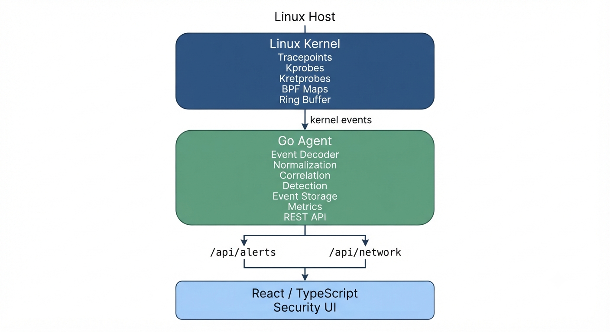

---

# Kernel Telemetry

The kernel implementation uses:

- eBPF
- BTF
- CO-RE-compatible kernel reads
- Tracepoints
- Kprobes
- Kretprobes
- BPF maps
- BPF ring buffers

## Required tracepoints

The current loader treats these core syscall tracepoints as required:

- `sys_enter_execve`
- `sys_enter_openat`
- `sys_enter_ptrace`
- `sys_enter_mprotect`
- `sys_enter_process_vm_writev`

## Optional security tracepoints

Loaded when available:

- `sys_enter_init_module`
- `sys_enter_finit_module`
- `sys_enter_bpf`
- `sys_enter_memfd_create`
- `sys_enter_socket`
- `sys_enter_unlinkat`
- `sys_enter_setns`

Optional probes are non-fatal so one unavailable kernel hook does not prevent the agent from using the rest of the telemetry.

## Optional network/security probes

The loader attempts:

- `tcp_v4_connect`
- `tcp_v6_connect`
- `udp_sendmsg`
- `udpv6_sendmsg`
- `inet_csk_accept`
- `inet_csk_listen_start`
- `ip_rcv`
- `ip6_rcv`
- `ip_output`
- `ip6_finish_output2`
- `commit_creds`

Kernel symbols vary between distributions and kernel versions, so these probes are intentionally optional.

---

# Network Telemetry

Network visibility combines socket-level telemetry with generic IPv4/IPv6 packet metadata.

## TCP

Outbound IPv4/IPv6 connections:

```text
tcp_v4_connect
tcp_v6_connect
```

Inbound connections:

```text
inet_csk_accept
```

Listener creation:

```text
inet_csk_listen_start
```

## UDP

IPv4/IPv6 UDP send activity:

```text
udp_sendmsg
udpv6_sendmsg
```

## Generic IPv4/IPv6 packet telemetry

The generic path uses:

```text
ip_rcv
ip6_rcv
ip_output
ip6_finish_output2
```

The common packet path can:

- Identify IPv4 versus IPv6.
- Record the IP protocol number.
- Record packet length.
- Extract source/destination addresses.
- Extract TCP/UDP/SCTP ports when applicable.
- Record direction.
- Emit metadata without capturing payloads.

### Protocol representation

| Protocol | Number |
|---|---:|
| ICMP | 1 |
| TCP | 6 |
| UDP | 17 |
| ICMPv6 | 58 |
| SCTP | 132 |
| Other IP protocols | `IP/<number>` |

## Socket creation

`sys_enter_socket` records address family, socket type, protocol, and process context.

This gives visibility into protocol families that do not use TCP-style connection semantics and supports signals for raw/packet socket creation.

A raw socket is a security signal, not automatic proof of malicious activity; legitimate diagnostics and security tooling can use these APIs.

## Network event model

Network records can contain:

```text
time
PID / PPID
process
event type
family
protocol
direction
source address / port
destination address / port
packet length
```

The network store is bounded, so telemetry does not grow without limit in memory.

## Network coverage boundary

The generic packet path is **IPv4/IPv6 Layer-3 oriented**, not complete Ethernet/L2 capture.

It does not provide universal visibility into ARP, LLDP, Ethernet-only frames, or every VLAN/L2 protocol. Additional XDP/TC or another suitable L2 sensor would be required for that.

The current IPv6 parser does not walk arbitrary extension-header chains; it records the immediate `next_header` value.

Socket-level and packet-level hooks can observe related activity. Userspace now applies bounded metadata deduplication to identical records within a configurable short window; semantically different events are retained.

## Payload boundary

Packet payloads are not captured by the generic network telemetry path. The design intentionally focuses on endpoint/network metadata rather than packet-content inspection.

---

# Event ABI

The event structure carries process identity, execution context, alert flags, IPv4/IPv6 addresses, ports, target PID, family, protocol, direction, credential fields, socket fields, and packet length.

### Event ABI visual reference

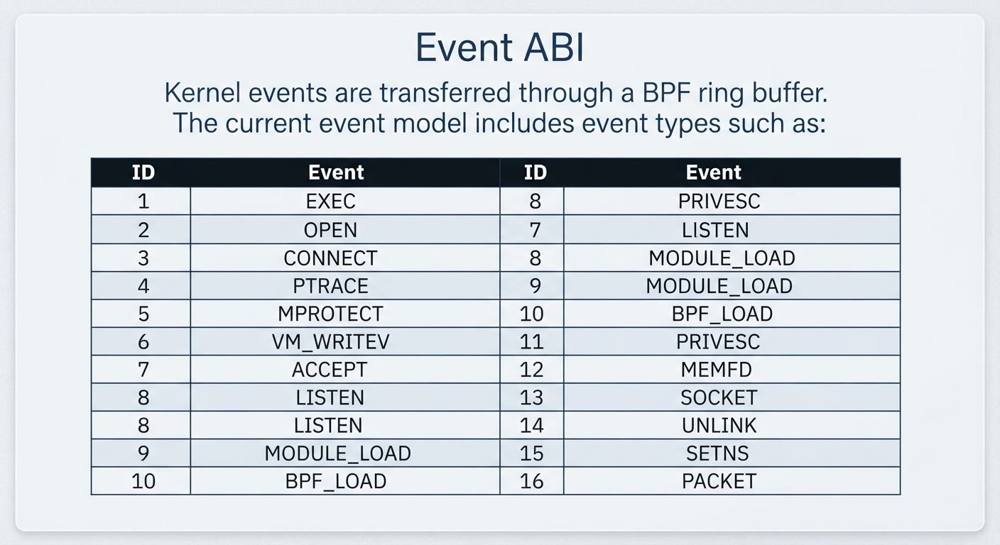

The ABI is a contract between the C/eBPF layer and Go. Changes to its field layout require coordinated kernel/userspace updates.

---

# Userspace Agent

The Go agent in `agent/` is responsible for:

1. Loading the embedded eBPF object.
2. Removing the required memlock restriction.
3. Attaching required and optional probes.
4. Reading the ring buffer.
5. Decoding the event ABI.
6. Maintaining bounded process correlation state.
7. Running detection logic.
8. Maintaining bounded network telemetry.
9. Exposing REST endpoints.
10. Exporting Prometheus metrics.

The loader explicitly distinguishes required tracepoints from optional probes, improving compatibility across Linux kernels.

---

# Detection Engineering

Detection logic is primarily implemented in `agent/detect.go`.

The detector maintains bounded process execution state and correlates later events within short time windows.

The design principle is:

> **Telemetry is evidence, not a verdict.**

Example:

```text
Process execution
      ↓
Shell/interpreter
      ↓
Recent execution state
      ↓
Outbound network connection
      ↓
Behavioral correlation
      ↓
REVERSE_SHELL_LIKELY
```

Another:

```text
Process A
   ↓
process_vm_writev()
   ↓
Process B
   ↓
CROSS_PROCESS_INJECT
```

---

# Detection Coverage
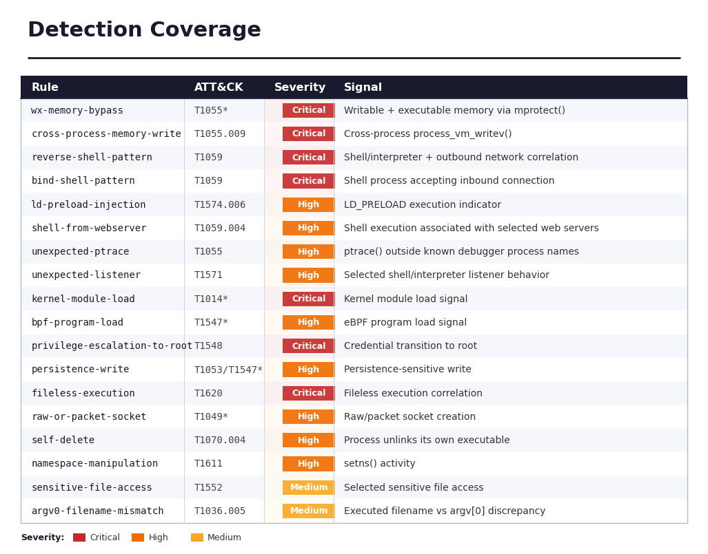

* ATT&CK mappings are approximate behavioral mappings, not claims that every event represents the technique.

### Detection context

For example:

```text
PROT_WRITE | PROT_EXEC
```

is security-relevant but not inherently malicious. JIT engines such as V8 can legitimately require executable writable memory.

Likewise, `ptrace()`, `process_vm_writev()`, raw sockets, eBPF loading, namespace manipulation, and kernel module loading can have legitimate uses.

Production deployments should therefore add context such as:

- Process identity
- Executable path
- Parent process
- Command line
- User/session
- Container identity
- Historical behavior
- Allow-lists
- Host role
- Deployment-specific policy

---

# SOC Dashboard

The React/TypeScript dashboard lives under `dashboard/` and consumes the Go API rather than communicating directly with eBPF.

Current presentation includes:

- Security alerts
- Severity
- Detection/rule information
- MITRE ATT&CK metadata
- Process context
- Timestamps
- Network telemetry


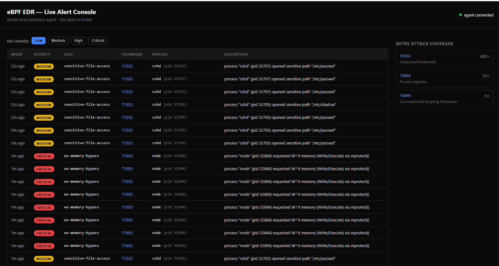

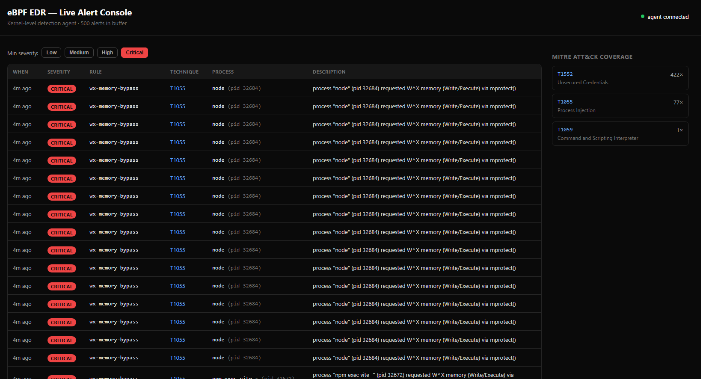

The data path is:

```text
Kernel → eBPF → Go Agent → REST API → React Dashboard
```

---

# Live Evidence

The repository contains captured evidence of the telemetry pipeline.

## Agent startup and telemetry

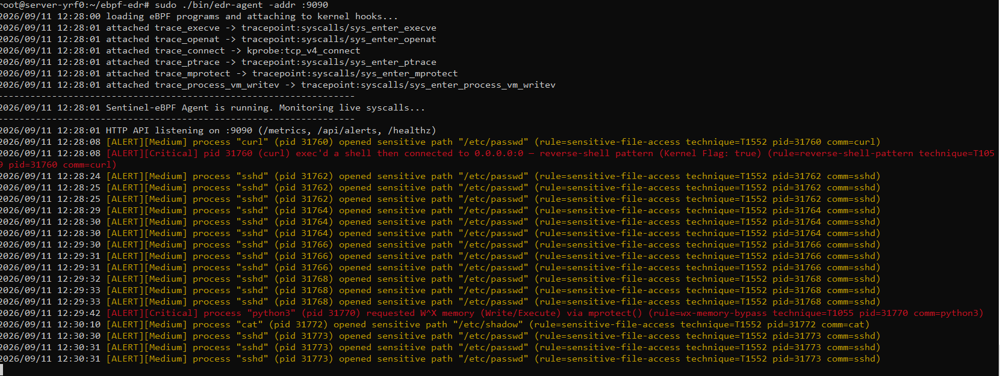

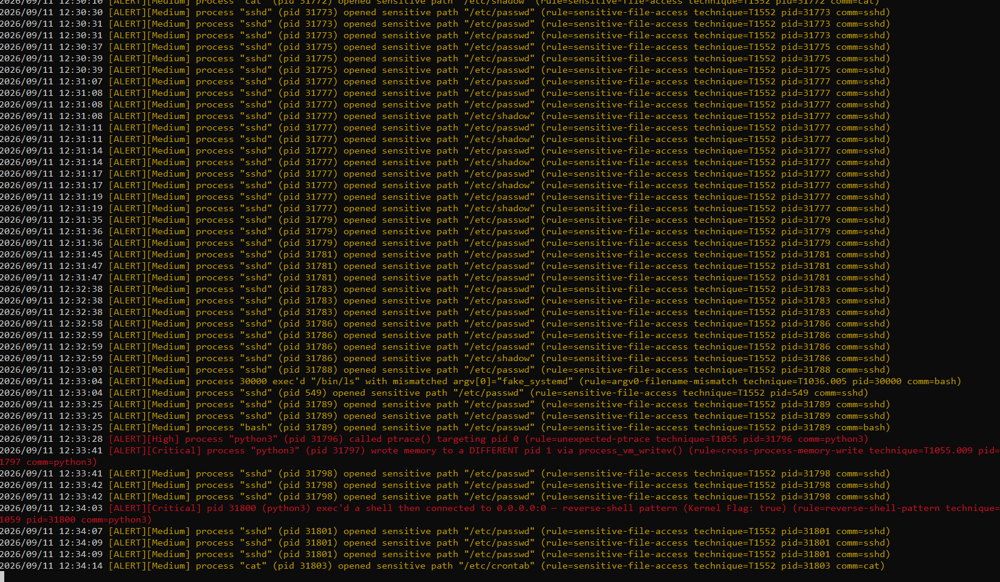

## W^X detection

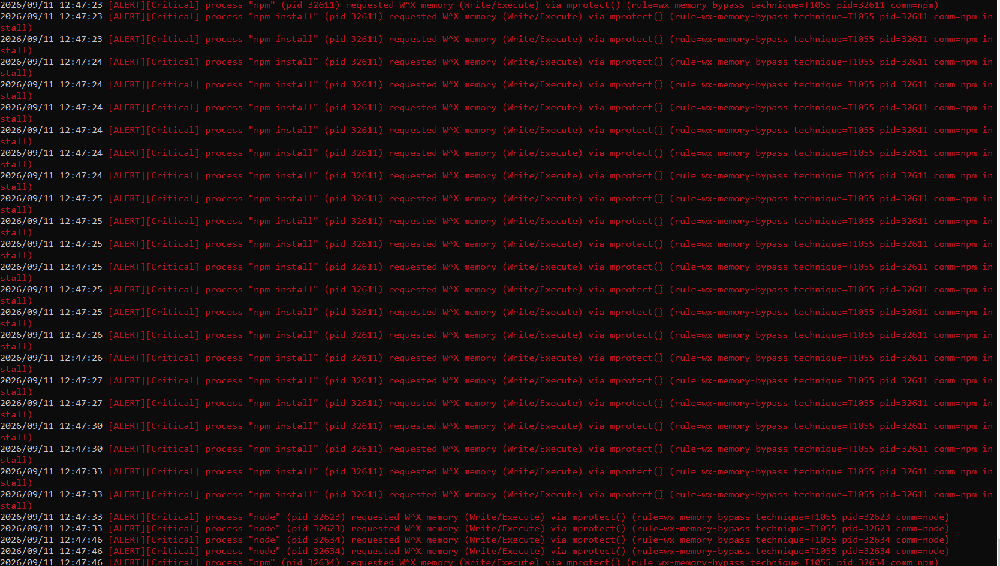

The test environment observed `mprotect()` requests involving `PROT_WRITE | PROT_EXEC`. Node.js/V8 can legitimately generate this behavior because of JIT compilation, demonstrating why behavioral signals require context.

## Alert API

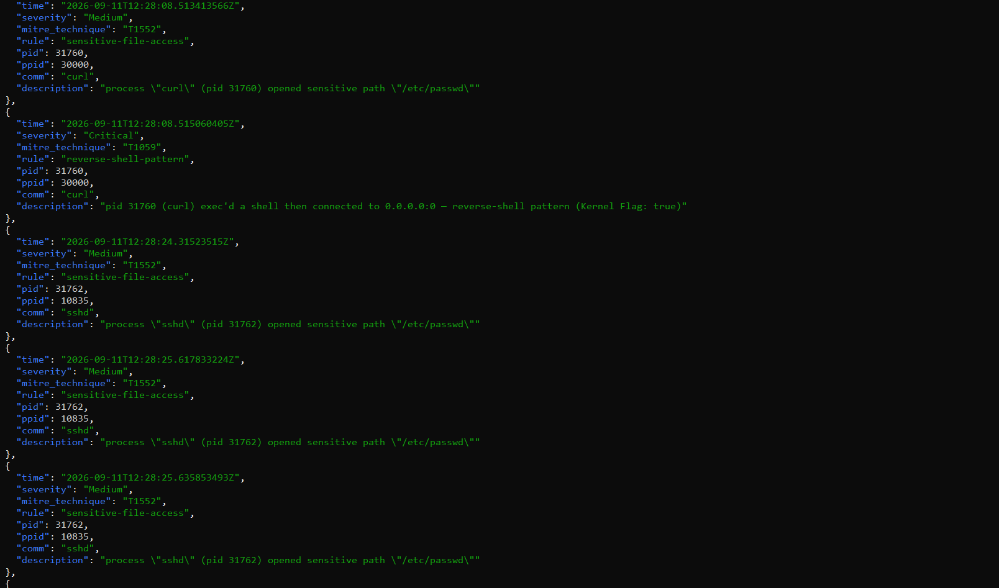

The structured alert API is exposed at:

```text
/api/alerts
```

## Additional evidence


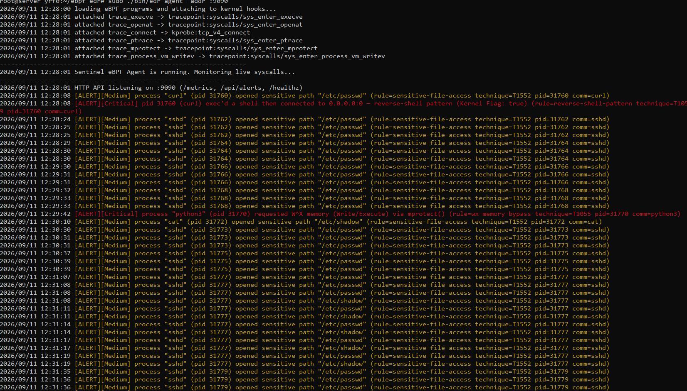

---

# Build & Run

## Requirements

- Linux
- Kernel with BTF support
- Clang
- LLVM
- libbpf
- libelf
- bpftool
- Go 1.22+
- Node.js/npm for dashboard builds
- Appropriate privileges/capabilities for eBPF loading

Check the kernel:

```bash
uname -r
```

Check BTF:

```bash
ls -l /sys/kernel/btf/vmlinux
```

## Ubuntu dependencies

```bash
sudo apt update
sudo apt install -y \
  build-essential \
  clang \
  llvm \
  libbpf-dev \
  libelf-dev \
  linux-tools-common \
  linux-tools-generic
```

## Clone

```bash
git clone https://github.com/locallhosts/ebpf-edr.git
cd ebpf-edr
```

## Generate `vmlinux.h`

```bash
make vmlinux
```

This generates `bpf/vmlinux.h` from:

```text
/sys/kernel/btf/vmlinux
```

The generated header is target-kernel-specific and should be regenerated when building against a substantially different kernel.

## Build

```bash
make bpf
make agent
```

Or:

```bash
make
```

The resulting agent is:

```text
bin/edr-agent
```

## Run

```bash
sudo ./bin/edr-agent -addr :9090
```

Or:

```bash
make run
```

## API

| Endpoint | Purpose |
|---|---|
| `/healthz` | Health check |
| `/metrics` | Prometheus metrics |
| `/api/alerts` | Security alerts |
| `/api/network` | Bounded network telemetry |

```bash
curl http://localhost:9090/healthz
curl http://localhost:9090/api/alerts
curl http://localhost:9090/api/network
curl http://localhost:9090/metrics
```

## Dashboard

```bash
make dashboard
```

Or:

```bash
cd dashboard
npm install
npm run build
```

## eBPF verifier validation

```bash
sudo make test-load
```

This loads the compiled eBPF object for verifier validation and immediately removes the temporary pinned program.

## Validation & performance

```bash
sudo make test-validation
make test-perf
```

The validation suite runs Go tests, race/stress coverage, static analysis, userspace benchmarks, eBPF/XDP compilation, source-level coverage assertions, and — when executed as root with `bpftool` — kernel verifier/load validation. Ring-buffer loss is counted in the kernel when reservation fails and exposed through `edr_ringbuf_lost_total`.

---

# Continuous Integration

The GitHub Actions workflow is:

```text
.github/workflows/build.yml
```

Current CI flow:

```text
Checkout
   ↓
Go 1.22
   ↓
Linux eBPF dependencies
   ↓
bpftool discovery
   ↓
Runner kernel BTF
   ↓
Generate bpf/vmlinux.h
   ↓
Compile eBPF
   ↓
Build Go agent
   ↓
Go tests
```

The workflow handles Ubuntu runner kernel-tool package differences and locates an installed `bpftool` binary instead of assuming a generic package layout.

The eBPF build is therefore validated against a real Linux kernel/BTF environment.

---

# Security Model & Limitations

## Kernel trust

A compromised kernel or sufficiently privileged kernel-level attacker can potentially interfere with the observation layer. eBPF telemetry should not be treated as an independent trusted boundary after kernel compromise.

## Coverage

The project monitors selected behaviors, not every Linux operation. Absence of an event does not prove absence of malicious activity.

## False positives

JIT runtimes, debuggers, profilers, network diagnostics, container tooling, security software, and administrators can legitimately perform security-sensitive operations.

## Kernel compatibility

BTF/CO-RE improve portability, but deployment still depends on kernel version, BTF availability, helper support, probe symbols, verifier behavior, and distribution configuration.

## Event pressure

High event rates can pressure the ring buffer and userspace processing path. Production deployments should monitor metrics and account for event loss.

## Network coverage

The generic kprobe packet path is IPv4/IPv6 oriented. An optional generic-mode XDP sensor now adds Ethernet/L2 ingress visibility, including one VLAN tag. Payload capture is intentionally outside the current design.


---

# Roadmap

## Telemetry

- [x] Process execution
- [x] Sensitive file access
- [x] `ptrace()`
- [x] `mprotect()`
- [x] Cross-process memory
- [x] Kernel module telemetry
- [x] eBPF load telemetry
- [x] `memfd_create()`
- [x] Namespace manipulation
- [x] Process self-deletion
- [x] IPv4 TCP
- [x] IPv6 TCP
- [x] IPv4 UDP
- [x] IPv6 UDP
- [x] TCP accept/listen
- [x] Socket creation
- [x] Generic IPv4 packet telemetry
- [x] Generic IPv6 packet telemetry
- [x] Expanded Layer-2/XDP telemetry
- [x] IPv6 extension-header traversal

## Detection Engineering

- [x] Kernel-side behavioral signals
- [x] Stateful process correlations
- [x] Reverse-shell indicators
- [x] Bind-shell indicators
- [x] W^X detection
- [x] Process-injection indicators
- [x] Fileless-execution indicators
- [x] Persistence indicators
- [x] Raw/packet-socket indicators
- [x] Namespace manipulation indicators
- [x] Configurable detection policies
- [x] Environment-specific allow-lists
- [x] Network event deduplication
- [x] Expanded ATT&CK coverage

## Operations

- [x] Go agent
- [x] REST API
- [x] Prometheus metrics
- [x] Network telemetry API
- [x] Health endpoint
- [x] React/TypeScript dashboard
- [x] GitHub Actions CI
- [x] Reproducible performance benchmarks
- [x] Event-loss stress testing
- [x] Container-aware telemetry
- [x] SIEM/SOAR integrations

---

# Development Workflow

```text
Modify eBPF program
        ↓
Generate/update kernel types
        ↓
Compile eBPF object
        ↓
Run verifier validation
        ↓
Build Go agent
        ↓
Run tests
        ↓
Generate controlled behavior
        ↓
Inspect telemetry
        ↓
Validate detection
        ↓
Validate API
        ↓
Validate dashboard
        ↓
Document limitations
```

The project treats **implementation, verification, detection validation, and documentation as separate engineering concerns**.

---

# Project Status

The active branch is:

```text
master
```

Current implementation includes:

- Kernel-level eBPF instrumentation
- Required/optional probe loading
- BTF-derived kernel types
- BPF ring-buffer event transport
- Structured event ABI
- Go userspace decoding
- Stateful behavioral correlation
- Security alert generation
- IPv4/IPv6 network telemetry
- Generic IP packet metadata
- Optional XDP Ethernet/L2 ingress telemetry
- Bounded IPv6 extension-header parsing
- Socket telemetry
- Expanded ATT&CK-aligned detection mappings
- Bounded network event storage
- Configurable detection policy and allow-lists
- Network metadata deduplication
- Best-effort container/cgroup context
- Vendor-neutral SIEM/SOAR webhook integration
- REST APIs
- Prometheus metrics
- React/TypeScript dashboard
- Automated Linux CI

This repository is maintained as a **security engineering and research project**. Production deployment should include additional hardening, compatibility testing, policy configuration, observability, and independent validation.

---

# Engineering Lessons

### Kernel/userspace ABI design

The event structure is a contract between C/eBPF and Go. Field-layout changes require coordinated updates.

### Verifier-aware programming

eBPF memory access, pointer arithmetic, parsing, loops, and data reads must remain bounded and verifier-safe.

### Kernel compatibility

Compilation does not guarantee deployment compatibility. BTF, CO-RE, kernel symbols, helpers, probe availability, and verifier behavior all matter.

### Detection versus observation

Collecting an event and interpreting it are separate problems. eBPF EDR intentionally keeps those layers distinct.

### Network telemetry design

Socket-level telemetry provides process context while generic packet hooks broaden protocol visibility. Combining both increases coverage but introduces kernel-version dependencies; bounded userspace deduplication reduces repeated metadata without collapsing distinct directional events.

### Operational policy

Detection policy belongs outside the kernel collection layer. This project therefore keeps allow-lists, rule suppression, integration delivery, and operational tuning in userspace so telemetry collection remains stable while deployment policy can vary.

---

# License

MIT License. See [LICENSE](LICENSE).

## Author

**locallhosts**  
Security Engineering · Linux Security · eBPF · Detection Engineering · Security Automation

[GitHub](https://github.com/locallhosts)
